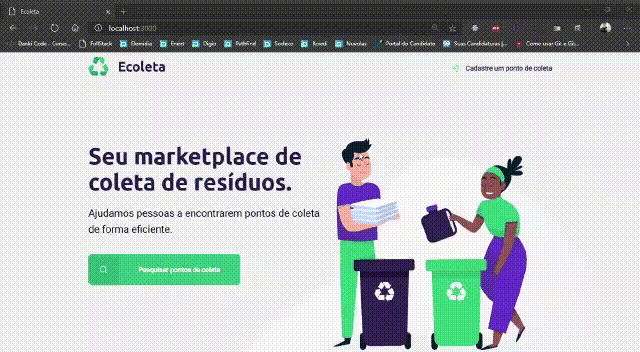

<h1 align="center">
    
</h1>

<h1>
    
</h1>

---

## Indice
- [Sobre](#-sobre)
- [Projeto](#-projeto)
- [Tecnologias](#-tecnologias)

---
## 🔖 Sobre
Projeto (Ecoleta) feito durante a primeira edição da Next Level Week.

---

## 💻 Projeto
O **Ecoleta** é um marketplace que tem como objetivo ajudar pessoas a encontrarem pontos de coleta de resíduos de forma eficiente.

---

## 👨🏻‍💻 Tecnologias
- [JavaScript](https://www.javascript.com/)
- [HTML](https://html.com/)
- [Node.js](https://nodejs.org/en/)

--- 

<h3 align="center">
    Desenvolvido por Rodrigo Tavares 🐱‍👤
</h3>
